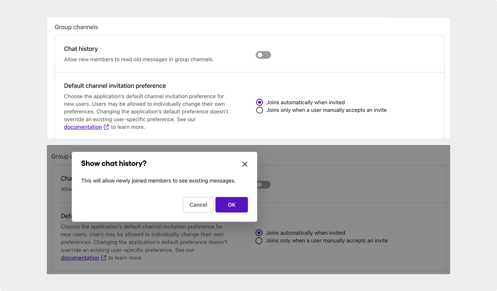

import InteractiveButton from "@site/src/components/InteractiveButton";

# UX writing

Sendbird  |  May 2022

## Overview

As a technical and UX writer at Sendbird, a SaaS chat solution provider, I was responsible for crafting and improving in-product copy across the dashboard to make settings and actions clearer for users.

## Scope of work

- Wrote and refined UI copy for toggle labels, descriptions, tooltips, error messages, and other elements.
- Translated technical functionality into clear, actionable language to reduce user friction.
- Partnered with the design team in Figma to align copy with design intent and user flows.
- Maintained consistency and clarity while ensuring alignment with product tone and UX standards.

## Outcome

- Enhanced self-serve usability for users interacting with advanced configuration settings.
- Improved overall UX consistency by applying clear language patterns across similar components.

_Note: The screenshot below highlights examples of the UX copy I wrote for the dashboard._

