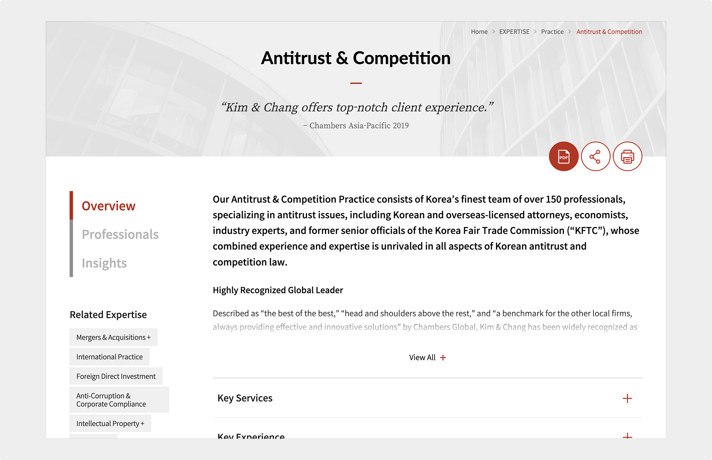

import InteractiveButton from "@site/src/components/InteractiveButton";

# Website Content Writing

Kim & Chang | February 2020

## Overview

As the content marketing editor at Kim & Chang, Korea's leading law firm, I managed content development for a full-scale website redesign, focusing on core informational pages and UX copy.

<InteractiveButton url="https://www.kimchang.com/en/expertise/view/antitrust-competition">
	View Project →
</InteractiveButton>

_Note: All content was written or edited by me during my tenure. Some pages may have been modified since._

## Scope of Work

- Wrote and edited content for key pages, including the home, expertise, insights, and about pages, with a focus on clear messaging and content structure.
- Developed UX copy such as page titles, navigation menus, and button labels to support usability across responsive layouts.
- Localized Korean-language content for English-speaking audiences, preserving nuance and legal accuracy.

## Outcome

- Delivered a cohesive and accessible web experience that improved user understanding of the firm's services and expertise.
- Helped strengthen the firm's digital presence and global positioning through clear, consistent, and professionally crafted content.

